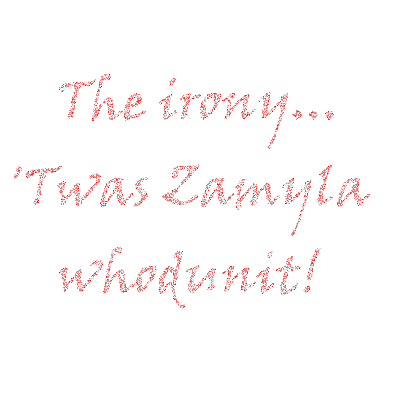

# whodunit.c

Найнезрозуміліше вбивство
Вітаємо вас у маєтку Тюдорів. Людина, що вас приймала – містер Джон Бодді – на жаль, раптово помер - він став жертвою шахраїв. І вам потрібно дізнатись, хто вбивця у цьому детективі.

На жаль для вас (і навіть на ще більший жаль для містера Бодді), єдиний доказ - це 24-бітний BMP файл під назвою `clue.bmp` (зображений нижче), який намалював містер Бодді на своєму комп'ютері у його останні хвилини. Серед червоного «шуму» заховано малюнок, який підкаже нам, хто ж вчинив убивство.

# My answer

